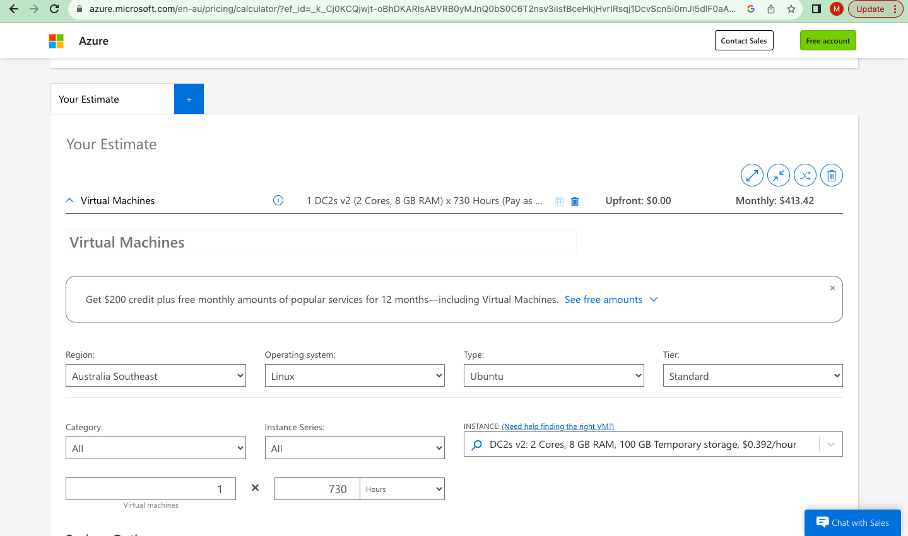
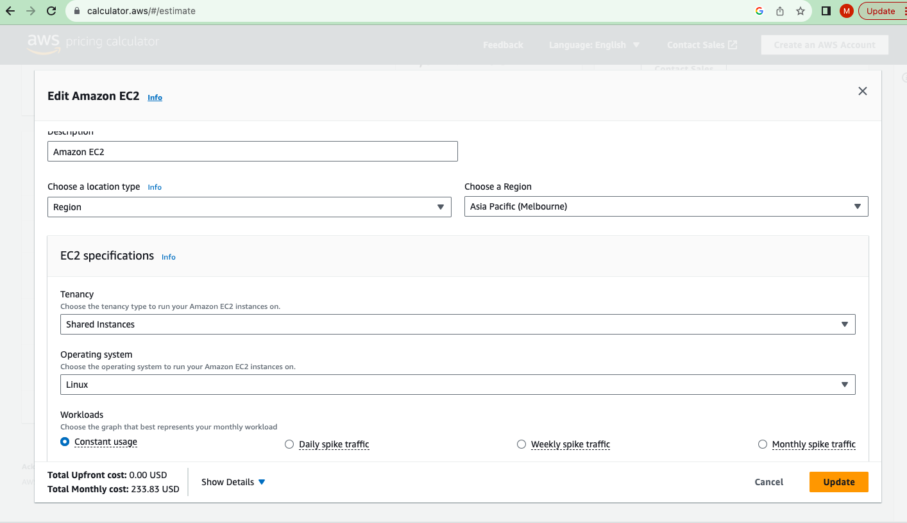
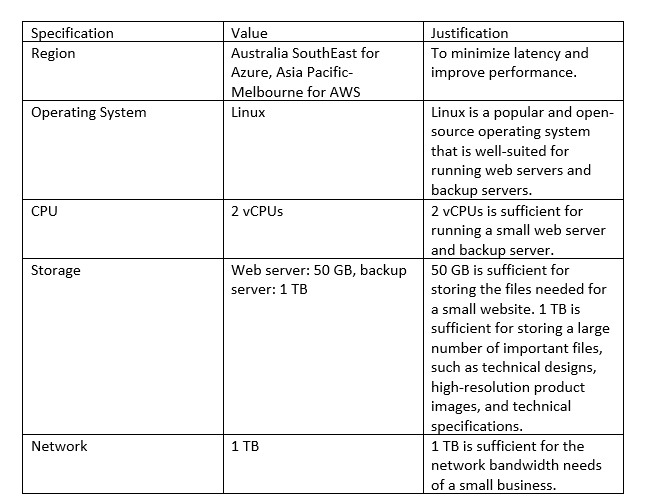
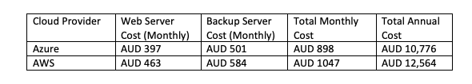

# Cloud Services
This section gives pricing for a cloud setup for the company and discusses backup strategies utilising the cloud.

[Pricing](#pricing-for-cloud-services) | [Backup](#backup-strategies) | [Plan](./plan.md) | [Network Design](./network.md) | [Security](./security.md) | [Reflection](./reflection.md) | [Return to index](./README.md)

## Pricing for Cloud Services

#### Excel Flies Uploaded
- Web Server - Pricing for Azure [View Estimated cost of Web Server for Azure spreadsheet](./Files/Web_Server_Pricing_for_Azure.xlsx)
- Web Server - Pricing for AWS [View Estimated cost of Web Server for AWS spreadsheet](./Files/Web_Server_Pricing_for_AWS.csv) 
- Backup Server - Pricing for Azure [View Estimated cost of Backup Server for Azure spreadsheet](./Files/Backup_Server_Pricing_for_Azure.xlsx)
- Backup Server - Pricing for AWS [View Estimated cost of Backup Server for AWS spreadsheet](./Files/Backup_Server_Pricing_for_AWS.csv)
  
To estimate the cost of the cloud services for a web server and a backup server using two different cloud providers, we considered Azure and AWS as examples. We will provide an overview of the specifications, costs, and reasons for selecting each cloud provider.

### Web Server Using Linux Operating System:

#### Specifications:

Region: Australia (Australia SouthEast for Azure, Asia Pacific-Melbourne for AWS)  
Operating System: Linux (Ubuntu)  
CPU: 2 vCPUs  
RAM: 4 GB  
Storage: 50 GB SSD  
Data Transfer: 100 GB per month (estimated)  
Purpose: Hosting the public website of the company with product information.  

-	Azure:

Estimated monthly Cost: Approximately AUD 397/month  
Reason for Selection: Azure provides a competitive pricing model for virtual machines, and it has a data center in Australia SouthEast, which is suitable for hosting the web server for an Australian company.

-	AWS:

Estimated monthly Cost: Approximately USD 298/month (AUD 463)  
Reason for Selection: AWS offers a wide range of instance types and excellent reliability. Melbourne is a reliable choice for hosting servers in Australia.

### Backup Server Using Linux Operating System:

#### Specifications:

Region: Australia (Australia SouthEast for Azure, Asia Pacific-Melbourne for AWS)  
Operating System: Linux  
CPU: 2 vCPUs  
RAM: 8 GB  
Storage: 1 TB HDD (for backup purposes)  
Data Transfer: 200 GB per month (estimated)  
Purpose: Storing encrypted important files of the company.

-	Azure:

Estimated monthly Cost: Approximately AUD 501/month.  
Reason for Selection: Azure provides affordable storage options, and the Australia SouthEast region ensures data residency compliance for Australian companies.

-	AWS:

Estimated monthly Cost: Approximately USD 376/month (AUD 584)  
Reason for Selection: AWS offers a range of storage solutions, and the Melbourne region is well-suited for data storage, ensuring data sovereignty.

### Evidences for using Pricing Calculators of Azure And AWS

- Azure
   
- AWS

### Recommendation

Based on the pricing above, I recommend that the company use Azure for their cloud services. Azure is slightly cheaper than AWS for both the web server and the backup server. Additionally, Azure has a number of features that are beneficial for small businesses, such as:

-	Azure Active Directory: Azure Active Directory is a cloud-based identity and access management (IAM) service that can be used to manage user accounts and access to resources.
-	Azure Backup: Azure Backup is a cloud-based backup service that can be used to protect data on-premises and in the cloud.
-	Azure Site Recovery: Azure Site Recovery is a cloud-based disaster recovery service that can be used to replicate data and applications to the cloud so that they can be recovered in the event of a disaster.

### Important Specifications

The following table summarizes the important specifications for the web server and the backup server

#### Monthly Cost and Annual Cost

The following table shows the monthly and annual cost for the web server and the backup server in each cloud provider:

#### Conclusion

Based on the pricing, features, and specifications above, we recommend that the company use Azure for their cloud services. Azure is slightly cheaper than AWS and has several features that are beneficial for businesses.

## Backup Strategies

### Comparison of Backup Strategies for the Company:

#### Local Backup Only:

##### Advantages:

-	Full control and ownership of data: The company retains complete control over its confidential information by storing backups on local servers/disks.
-	Security: The data is stored on local servers/disks that are owned and operated by the company, so it is not susceptible to cloud-based security breaches.
-	Reduced cost: Local backups typically less expensive than cloud backups.
-	Low latency: Retrieving data from local backups is usually faster compared to cloud-based backups.

##### Disadvantages:

-	Limited disaster recovery: Local backups may be vulnerable to on-site disasters (e.g., fire, theft, accidents, natural disasters) that could result in data loss.
-	Manual maintenance: Local backups require manual effort to ensure data is consistently and securely backed up.
-	Scalability challenges: Expanding storage capacity can be costly and require hardware upgrades.
-	Accessibility: Local backups may not be accessible if the company's servers/disks are damaged or destroyed.

#### Backup to the Cloud If Data Is Encrypted Before Sent to the Cloud:

##### Advantages:

-	Data security: Confidential information remains protected through encryption before transmission to the cloud. The data is encrypted before it is sent to the cloud, so it is protected from unauthorized access.
-	Off-site backup: Cloud storage provides off-site redundancy, safeguarding data against on-site disasters.
-	Scalability: Cloud storage can easily scale to accommodate growing backup needs.
-	Accessibility: Cloud backups can be accessed from anywhere with an internet connection.

##### Disadvantages:

-	Encryption complexity: Implementing encryption mechanisms may require additional resources and expertise.
-	Costs: Cloud storage incurs ongoing subscription costs, which may accumulate over time. So, Cloud backups can be more expensive than local backups.
-	Dependency on cloud service: Reliable internet connectivity is essential for backing up data to the cloud.

#### Backup to the Cloud Without Encryption:

##### Advantages:

-	Convenience: Backup process is simplified and manageable without encryption overhead.
-	Cost-effective: Lower upfront costs as encryption processes are not required.
-	Accessibility: Data can be accessed from anywhere with an internet connection.

##### Disadvantages:

-	Security risk: Confidential data is susceptible to unauthorized access which is exposed to potential breaches if not encrypted during transmission.
-	Compliance concerns: Some data protection regulations may require encryption, raising compliance issues.
-	Dependency on cloud provider: Data is stored in a third-party environment, relying on the provider's security measures.

#### Backup Approaches for University Work (Personal Perspective):

In our university work, my group members and I adopt different backup approaches for redundancy and data protection:

##### Local and Cloud Backups with Encryption:

-	We use cloud backup services (e.g., Google Drive, Dropbox) to store our assignments, research papers, and project files.
-	All data is encrypted before being uploaded to the cloud to ensure data security.
-	Additionally, we maintain local backups on external hard drives or network-attached storage (NAS) devices for quick access and redundancy.

##### Version Control Systems (VCS):

-	For collaborative coding and software development projects, we utilize version control systems like Git and platforms like GitHub.
-	VCS not only serve as backup mechanisms but also enable collaboration, version tracking, and easy recovery of code and documentation.

##### Laptop Encryption:

-	To protect data in case of laptop theft or loss, we enable full-disk encryption (e.g., BitLocker for Windows, FileVault for macOS) on our personal computers.
-	This ensures that even if our laptops are stolen, unauthorized access to data is highly unlikely.
-	Each of these approaches contributes to data redundancy, security, and accessibility, mitigating the risk of data loss or theft. The choice of approach depends on the specific requirements of the task and the level of security needed for the data involved.

#### How our backup approaches would be useful if our primary personal computer was stolen

If our primary personal computer was stolen, we would be able to restore our work from our backups. For example, if we use a cloud-based backup service, we can simply sign into our account on another computer and download our files. If we use a local backup device, we can connect the device to another computer and copy our files.
