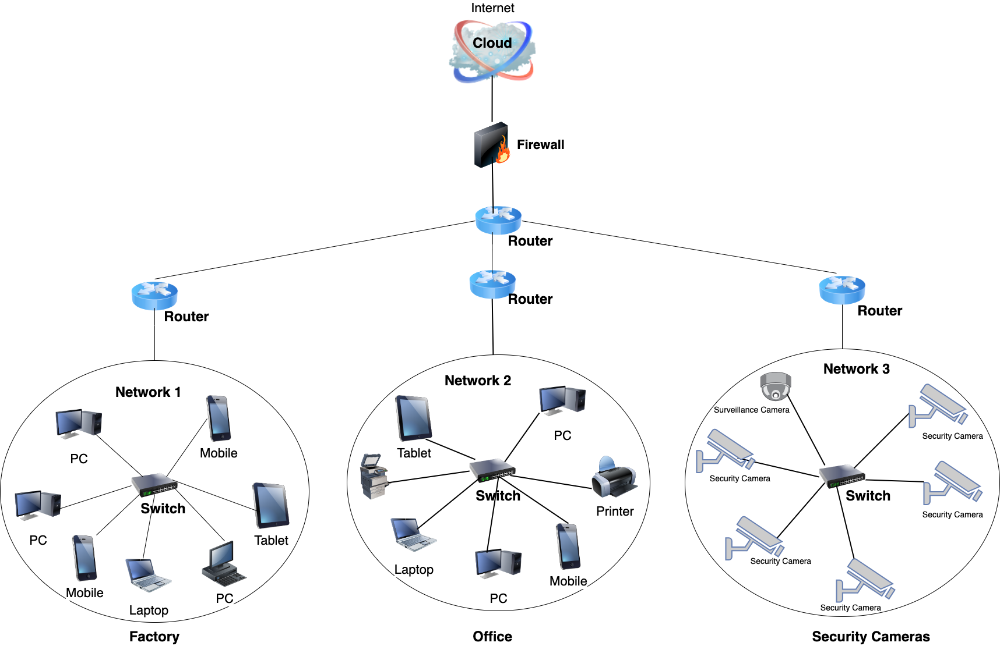

# Network Design
This section lists the main assumptions and requirements made in designing the network, and then presents the detailed network design.

[Assumptions and Requirements](#assumptions-and-requirements) | [Network Design](#network-design-details) | [Plan](./plan.md) | [Cloud Services](./cloud.md) | [Security](./security.md) | [Reflection](./reflection.md) | [Return to index](./README.md)

## Assumptions and Requirements
### Assumptions:

-	The company's office and factory are in close physical proximity. This assumption is based on the scenario's description of the factory and office buildings being attached.
-	The company uses standard Ethernet cabling for wired connections. This is a common practice in most office and factory environments.
-	The company employs a mix of Windows and Linux-based servers. Many companies use a combination of server types for various applications.
-	 It is assumed that the company has reliable internet connectivity for accessing cloud services and external resources.
-	We assume that the company has budget constraints, and cost-effective solutions should be prioritized.
-	The company plans to use cloud services, but the specific cloud service providers (e.g., Microsoft Azure, AWS, Google Cloud) are not specified.
-	Basic security measures, such as firewalls and antivirus software, are already in place, but the specific security infrastructure details are not provided.
-	The factory machinery with network interfaces is assumed to be compatible with the existing network infrastructure.
-	Employees' personal devices (e.g., phones, laptops) are assumed to support standard Wi-Fi connectivity and have antivirus software installed.
-	The existing office printers are assumed to be compatible with the network and capable of network printing.
-	The company's security camera system supports IP streaming. IP-based cameras are becoming the industry standard for security surveillance.
-	The company's employees are trained in basic cybersecurity practices. Basic cybersecurity awareness among employees is essential to mitigate risks.

### Requirements:

-	The network must support a minimum of three separate IP subnets (factory, office, security cameras). This aligns with the scenario's requirement and allows for network segmentation.
-	Maintain local servers in the office for storing and securing important intellectual property, including engineering designs and financial data.
-	All devices, including machinery, computers, and security cameras, must have reliable network connectivity. Ensuring all devices are connected is fundamental to operations.
-	Data traffic between the factory and office subnets should be secure and isolated. This requirement enhances data security and prevents unauthorized access.
-	Cloud services must be integrated for the company website and email. Cloud hosting provides scalability and accessibility benefits.
-	Data backup and recovery solutions must be in place for critical information hosted locally. Data loss prevention is essential for intellectual property protection.
-	Access controls and user authentication mechanisms must be implemented to protect sensitive data. Security measures should restrict unauthorized access.
-	Network monitoring tools and intrusion detection systems should be deployed. Proactive monitoring helps detect and respond to security threats.
-	Regular security audits and vulnerability assessments must be conducted. Ongoing assessments help identify and address security weaknesses.
-	Employee training programs on cybersecurity best practices should be provided. Educated employees are the first line of defense against cyber threats.
-	Use /24 and/or /16 network masks as specified by the company.
-	Implement IP-based security cameras and a local server for storing and monitoring video feeds.
-	Design a scalable network architecture that can accommodate future growth in terms of devices and users.
-	Provide user training on best practices for network security, including strong password policies and safe internet usage.
-	Implement secure remote access solutions for employees who need to work remotely or access network resources from outside the office.
-	Establish a robust data backup and recovery strategy for critical business data.

## Network Design Details

### Design Decisions:

-	Network Segmentation: The network will be segmented into three subnets, one for the factory, one for the office, and one for the security cameras. This segmentation enhances security and isolates network traffic.

-	IPv4 Address Ranges: We will use the student IDs to create IP address ranges. We choose student ID 12247560; IP addresses will start with 60.

-	Network Mask: We will use a /24 network mask for each subnet to allow for sufficient host addresses within each segment.

### IP Address Allocation:

#### Factory Subnet:

-	IP Range: 60.1.0.0/24
-	Factory Machinery: 60.1.0.1 to 60.1.0.254
-	DHCP Range: 60.1.0.100 to 60.1.0.199 (for employee devices)

#### Office Subnet:

-	IP Range: 60.2.0.0/24
-	Office Devices: 60.2.0.1 to 60.2.0.254
-	DHCP Range: 60.2.0.200 to 60.2.0.254 (for employee devices)
#### Camera Subnet:

-	IP Range: 60.3.0.0/24
-	Security Cameras: 60.3.0.1 to 60.3.0.254 (This subnet overlaps with the Factory subnet for simplicity, but can be isolated as needed)

### Recommended Hardware:

-	Router/Firewall: Use a business-grade router/firewall for network security and traffic management. Brands like Cisco, Fortinet, or Palo Alto Networks are recommended. For Firewall: Gigabit Ethernet ports, firewall features, VPN support
For VPN router: Gigabit Ethernet ports, VPN features
-	High-speed Gigabit Ethernet backbone.

-	Switches: Employ managed switches to support VLANs and enhance network management. Cisco Catalyst or HP Aruba switches are suitable choices.

-	Access Points (APs): Deploy enterprise-grade access points for robust wireless coverage. Brands like Ubiquiti or Cisco Meraki can provide reliable APs. (Dual-band 802.11ac support)

-	Network Storage (Local Servers): Set up dedicated network-attached storage (NAS) devices for local servers in the office building. Synology or QNAP NAS units can be considered.

-	Security Cameras: Choose IP-based security cameras with High-resolution video and night vision from reputable brands such as Hikvision or Axis Communications. Ensure compatibility with the chosen NVR (Network Video Recorder).

-	NVR (Network Video Recorder): Select an NVR that can handle the number of cameras required for video storage and monitoring. Dahua or Bosch offer suitable NVR solutions.

-	Local server: Intel Xeon processor, 16GB RAM, 2TB hard drive

## The network diagram for the LAN:

